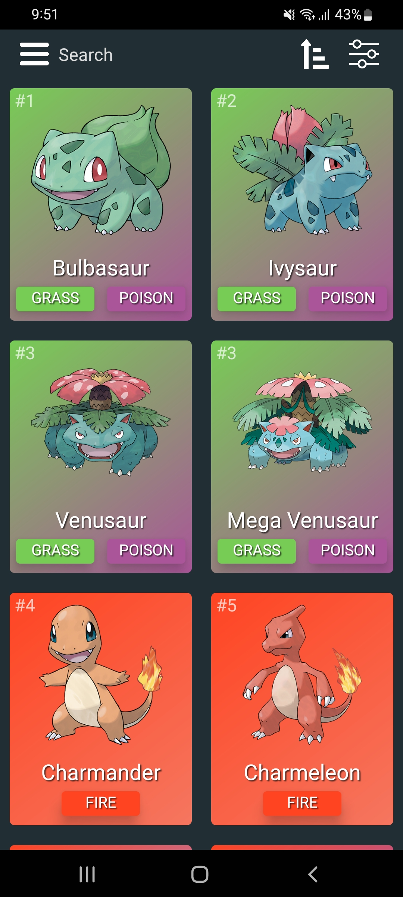
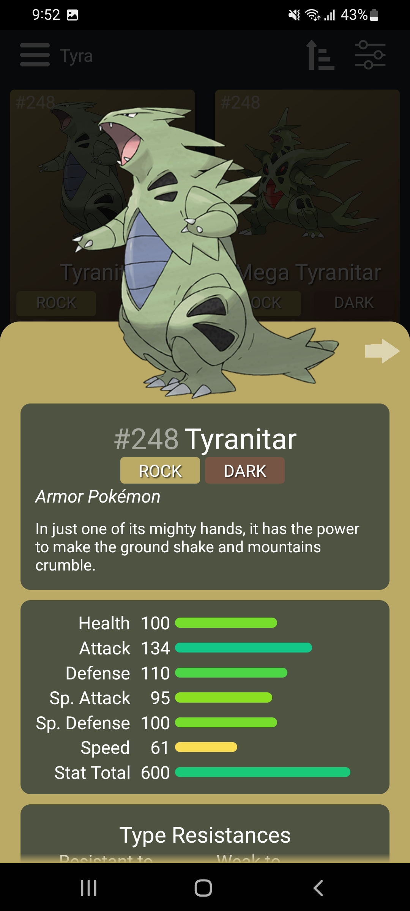
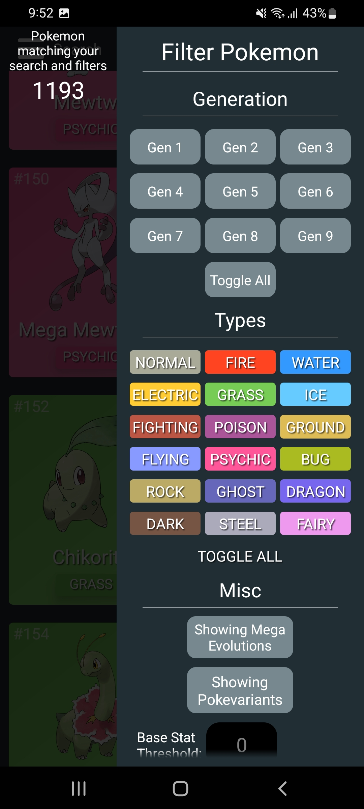
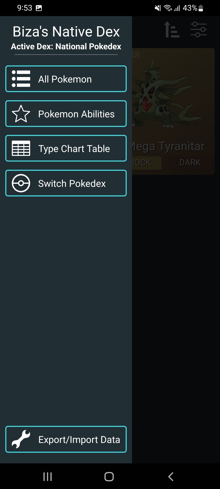

# NativeBizaDex

This is yet another Pokedex Android Mobile App. However I wanted to make this one open source and "generic" where you can use any datasource as long as it matches the expected JSON format. The data currently is scraped from a mix of https://pokemon.com pokedex and https://pokemondb.net. There are bunch of pokedex apps but they're mostly plagued by ads or the open source ones are very outdated, so I decided to create this.

Also it was a great learning exercise to try out and learn some React Native, and I'm quite happy with how it turned out.

# Images

|     Clean Minimalistic Interface      | Contains Base Stats, Types, Description, Evolution Tree, and more |
| :-----------------------------------: | :---------------------------------------------------------------: |
|  |                           |

| Supports Filtering (and searching/sorting) | Can Keep Track of Caught Pokemon + Switch Generational Pokedex |
| :----------------------------------------: | :------------------------------------------------------------: |
|             |                                   |

# Building

> **Note**: Make sure you have completed the [React Native - Environment Setup](https://reactnative.dev/docs/environment-setup) instructions till "Creating a new application" step, before proceeding.

## Generate/fetch PokeData Required

```bash
# using npm
npm run datagen
npm run imagegen
```

Ensure the datagen runs without errors before running the imagegen!
The datagen may fail sometimes as it has to fetch a lot of data from different pages. It will cache the previous ones.
So if it fails just run multiple times until it finishes successfully.

## Step 1: Start the Metro Server

First, you will need to start **Metro**, the JavaScript _bundler_ that ships _with_ React Native.

To start Metro, run the following command from the _root_ of your React Native project:

```bash
# using npm
npm start
```

Let Metro Bundler run in its _own_ terminal. Open a _new_ terminal from the _root_ of your React Native project. Run the following command to start your _Android_ or _iOS_ app:

### Step 2: For Android

```bash
# using npm
npm run android
```

## Outputs

To install production apk directly to device:

```sh
npm run android_production_install
```

To compile production apk:

```sh
npm run build:android
```

# License

I'm releasing this on MIT license. Feel free to use it in whichever way you like, suggest improvements, or fork freely.
